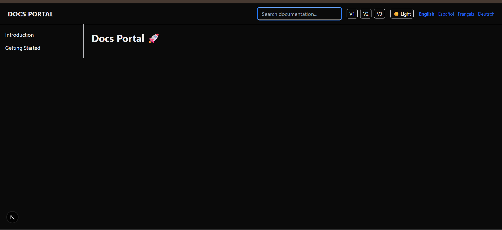
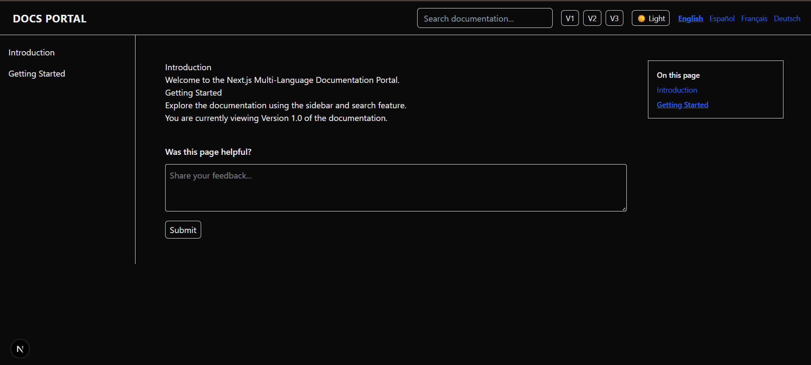
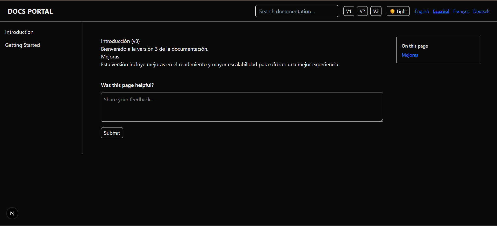
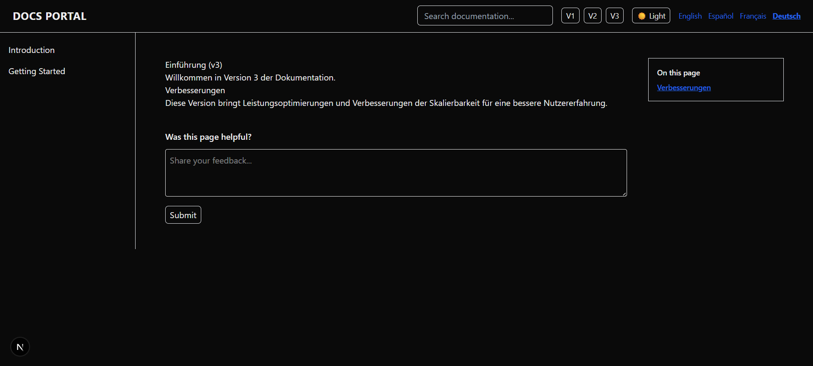
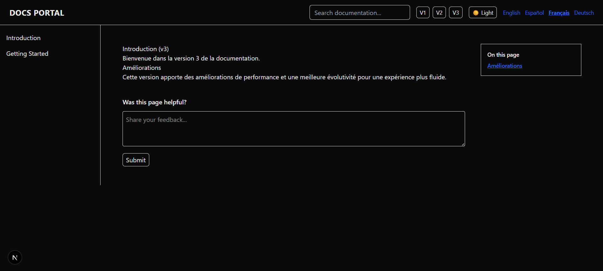

## Docs Portal – Multi-Language Documentation Platform

Docs Portal is a modern, scalable documentation platform built with Next.js. It delivers a professional documentation experience with support for static generation, multilingual content, version management, integrated search, API references, and containerized deployment. The project is designed to reflect real-world documentation systems used by SaaS products, developer tools, and enterprise platforms.

---

## Core Features

The platform uses a Markdown-based content system for simple and maintainable documentation authoring. It leverages static site generation with incremental revalidation to ensure both speed and content freshness. Built-in internationalization supports multiple languages including English, Spanish, French, and German. The system also supports multiple documentation versions such as v1, v2, and v3.

Additional features include client-side full-text search for quick navigation, automatic table of contents generation with active section highlighting, integrated API documentation powered by Swagger UI, light and dark theme switching, and page-level feedback collection. The entire application is fully containerized with Docker and Docker Compose for streamlined deployment.

---

## Tech Stack

The application is built using Next.js with the App Router architecture. Styling is handled using Tailwind CSS with theme variables for flexibility. Markdown content is processed using remark, remark-html, and remark-slug. FlexSearch powers the client-side search functionality, while swagger-ui-react is used for rendering API documentation. Docker and Docker Compose are used for containerization and deployment consistency.

---

## Project Structure

The project follows a modular and scalable folder structure. Documentation content is organized by language, dynamic routing manages language and version parameters, and reusable UI components such as headers, sidebars, and search modules are structured for maintainability. Public assets, including OpenAPI specifications, are stored separately along with Docker and environment configuration files.

---

## Environment Variables

All required configuration values are defined in the `.env.example` file to maintain consistency across development and production environments. These include application environment settings and public metadata variables used by Next.js. Sensitive information should always remain outside version control.

---

## Running with Docker

The application is fully containerized and can be launched using Docker Compose. This ensures consistent behavior across systems and simplifies deployment. After installing Docker and Docker Compose, the application can be built and started from the project root directory. Health checks are included to verify service readiness before marking the container as active.

---

## API Reference

An integrated API documentation section is available through Swagger UI. The OpenAPI specification is loaded from a static JSON file located in the public directory and rendered through a dedicated application route.

---

## Localization and Routing

The platform supports structured routing based on both language and version identifiers. Each documentation page follows a consistent URL format, allowing users to switch dynamically between languages and documentation versions through the interface.

---

## Incremental Static Regeneration

All documentation pages are statically generated for optimal performance. Incremental revalidation ensures that content updates are reflected at defined intervals without requiring a full rebuild of the application, combining high performance with up-to-date content delivery.

---

## Feedback System

Each documentation page includes a client-side feedback component that allows users to share their experience. The system operates without requiring a backend service, making it lightweight and efficient.

---

## Local Development Without Docker

The project can also be run locally without containers. After cloning the repository, dependencies can be installed using a preferred package manager. The development server supports hot reloading and runs on a local port for rapid testing and iteration.

---

## 📸 Screenshots

### 🏠 Home Page

### 🇬🇧 Version 1 - English

### 🇪🇸 Version 3 - Spanish

### 🇩🇪 Version 3 - German

### 🇫🇷 Version 3 - French

## Production Build

The application supports optimized production builds. Running the build process generates static assets and server output ready for deployment. The production server efficiently serves the compiled application for high-performance usage.